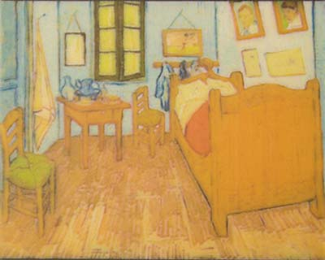
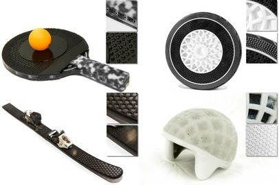
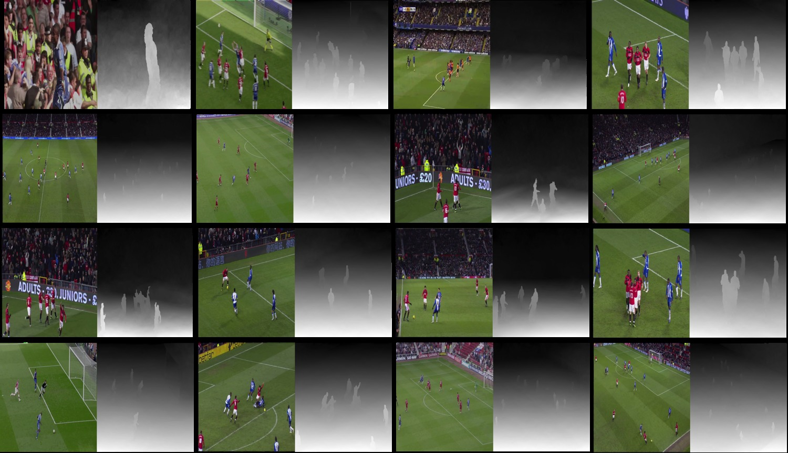
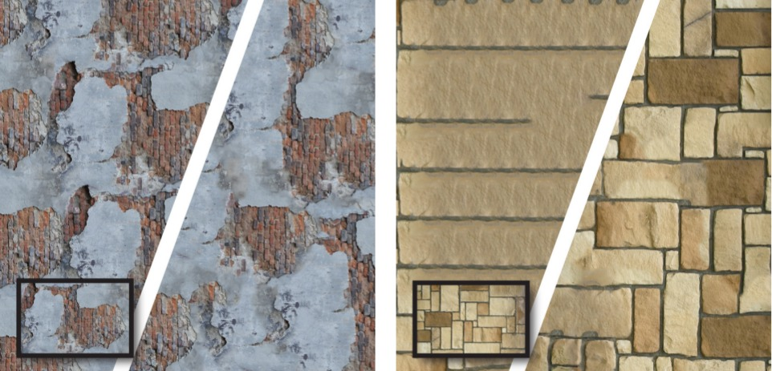
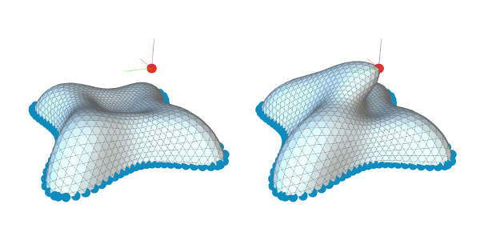

Currently, I am a PhD student in the [Computational Fabrication Group](http://cfg.mit.edu)
of Professor [Wojciech Matusik](http://people.csail.mit.edu/wojciech/).

Previously, I obtained a bachelor and master's degrees from [EPFL](http://www.epfl.ch) where I worked in the [Computer Graphics and Geometry laboratory](http://lgg.epfl.ch/) of Professor [Mark Pauly](http://lgg.epfl.ch/people.php).

# Interests

My research interests include computer graphics, vision and computational fabrication
with a specific interest for inverse problems, notably inverse procedural modeling.

Beside research, I like [photography](/photos), traveling, arts (especially drawing and painting) and philosophy.

# Publications

[Color Contoning for 3D Printing](publications/color-contoning)
Vahid Babaei, Kiril Vidimce, Mike Foshey, *Alexandre Kaspar*, Piotr Didyk and Wojciech Matusik

ACM SIGGRAPH, 2017

---

[Foundry: Hierarchical Material Design for Multi-Material Fabrication](publications/foundry)
Kiril Vidimce, *Alexandre Kaspar*, Ye Wang, Wojciech Matusik

UIST, 2016

---

[Gradient-based 2D-to-3D Conversion for Soccer Videos](publications/gradient-based-2d3d)
Kiana Calagari, Piotr Didyk, Mohamed Elgharib, *Alexandre Kaspar*, Mohamed Hefeeda and Wojciech Matusik

ACM Multimedia, 2015

---

[Self-Tuning Texture Optimization](publications/self-tuning-texture-optimization)
*Alexandre Kaspar*, Boris Neubert, Dani Lischinski, Mark Pauly and Johannes Kopf

Computer Graphics Forum (Proceedings Eurographics), 34(2), 2015

---

[Interactive Design Exploration for Constrained Meshes](publications/interactive-design-exploration)
Bailin Deng, Sofien Bouaziz, Mario Deuss, *Alexandre Kaspar*, Yuliy Schwartzburg and Mark Pauly

Computer-Aided Design 61: 13-23, 2015

---

[Realtime Deformation of Constrained Meshes on GPU](publications/rtime-deform-constrained-meshes)
*Alexandre Kaspar* and Bailin Deng

In GPU Computing and Applications, 15-34. Springer Singapore, 2015

# Projects

* [ofxOpenGP](https://github.com/xionluhnis/ofxOpenGP) - OpenFramework addon to use [OpenGP](https://github.com/OpenGP/OpenGP)
* [ofxVoronoi](https://github.com/xionluhnis/ofxVoronoi2D) - OpenFramework addon for 2d Voronoi geometry
* [node-svd](https://github.com/xionluhnis/node-svd) - Node.js [module](https://www.npmjs.com/package/node-svd) to use SVDLIBC
* [wxy](https://github.com/xionluhnis/wxy) - php application that runs this website, inspired by PicoCMS
* [zigfy](https://github.com/xionluhnis/zigfy) - jQuery extension to create picture galleries

# Contact
You can find me on [Github](http://github.com/xionluhnis)
or contact me by [email](http://www.google.com/recaptcha/mailhide/d?k=015RF3Lqoos53rsVHk93ss0g==&c=nNtnkzad2CLNJ9AGbEUs5Q==).
