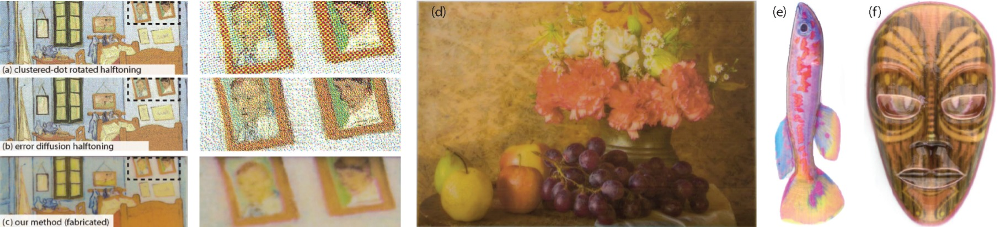

# Color Contoning for 3D Printing
Vahid Babaei, Kiril Vidimče, Michael Foshey, Alexandre Kaspar, Piotr Didyk and Wojciech Matusik 

SIGGRAPH 2017

## Abstract

Appearance reproduction is an important aspect of 3D printing. Current color
reproduction systems use halftoning methods that create colors through a
spatial combination of different inks at the object’s surface. This introduces
a variety of artifacts to the object, especially when viewed from a closer
distance. In this work, we propose an alternative color reproduction method
for 3D printing. Inspired by the inherent ability of 3D printers to layer
different materials on top of each other, 3D color contoning creates colors by
combining inks with various thicknesses inside the object’s volume. Since
inks are inside the volume, our technique results in a uniform color surface
with virtually invisible spatial patterns on the surface. For color prediction,
we introduce a simple and highly accurate spectral model that relies on
a weighted regression of spectral absorptions. We fully characterize the
proposed framework by addressing a number of problems, such as material
arrangement, calculation of ink concentration, and 3D dot gain. We use a
custom 3D printer to fabricate and validate our results.

## Links
* [Paper preprint](Color3DP.pdf)
