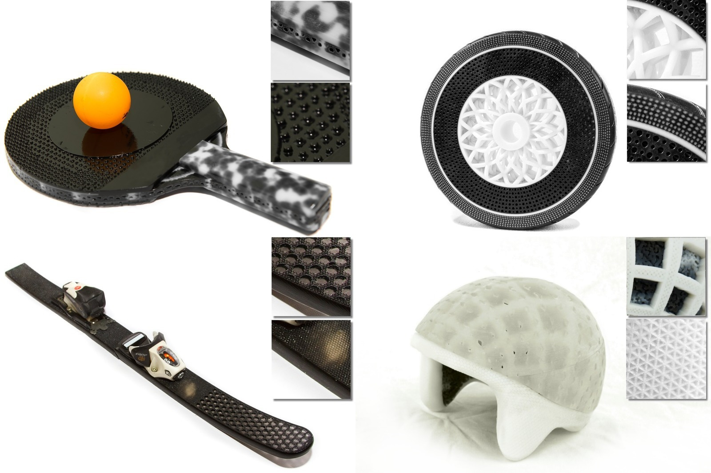

# Foundry: Hierarchical Material Design for Multi-Material Fabrication
Kiril Vidimce, Alexandre Kaspar, Ye Wang, Wojciech Matusik

UIST 2016

## Abstract

We demonstrate a new approach for designing functional material definitions for multi-material fabrication using our system called Foundry.

Foundry provides an interactive and visual process for hierarchically designing spatially-varying material properties (e.g., appearance, mechanical, optical). The resulting meta-materials exhibit structure at the micro and macro level and can surpass the qualities of traditional composites. The material definitions are created by composing a set of operators into an operator graph.

Each operator performs a volume decomposition operation, remaps space, or constructs and assigns a material composition. The operators are implemented using a domain-specific language for multi-material fabrication; users can easily extend the library by writing their own operators. Foundry can be used to build operator graphs that describe complex, parameterized, resolution-independent, and reusable material definitions.

We also describe how to stage the evaluation of the final material definition which in conjunction with progressive refinement, allows for interactive material evaluation even for complex designs. We show sophisticated and functional parts designed with our system.

## Links
* [Project](http://vidimce.org/publications/foundry/)
* [Paper preprint](uist2016_foundry.pdf)
* Press: [CSAIL News](https://www.csail.mit.edu/designing_for_3D_printing),
  [MIT News](http://news.mit.edu/2016/designing-3-d-printing-foundry-1011),
  [Engadget](https://www.engadget.com/2016/10/11/mit-foundry-software-the-photoshop-of-3d-printing/),
  [Techcrunch](https://techcrunch.com/2016/10/11/mits-new-software-makes-multi-material-3d-printing-easy/),
  [ZDNet.be](http://www.zdnet.be/nieuws/186985/mit-ontwikkelt-baanbrekende-photoshop-voor-3d-printers/),
  [Fastweb.it](http://www.fastweb.it/smartphone-e-gadget/mit-crea-foundry-un-software-per-stampanti-3d-simile-a-photoshop/),
  [3D Print](https://3dprint.com/151849/foundry-mit-csail-3d-modeling/),
  [3Ders](http://www.3ders.org/articles/20161011-mits-foundry-design-tool-makes-multi-material-3d-printing-easier-and-more-precise-than-ever.html),
  [3DPrintingIndustry](https://3dprintingindustry.com/news/foundry-founded-mit-create-photoshop-3d-printing-96780/),
  [AZO Materials](http://www.azom.com/news.aspx?newsID=46586),
  [Sohu](http://mt.sohu.com/20161012/n470107551.shtml)
