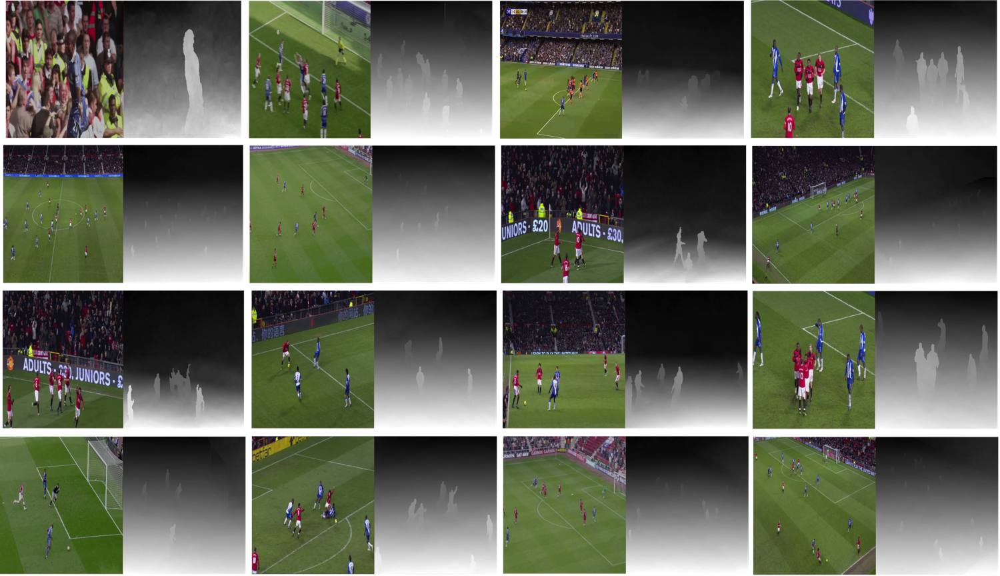

# Gradient-based 2D-to-3D Conversion for Soccer Videos

Kiana Calagari, Piotr Didyk, Mohamed Elgharib, Alexandre Kaspar, Mohamed Hefeeda and Wojciech Matusik

ACM Multimedia, 2015

# Abstract
A wide spread adoption of 3D stereoscopic television is hindered by the lack of
high-quality 3D content. One promising solution to address this need is to use
automated 2D-to-3D conversion. Current conversion methods, while general, produce 
low-quality results that exhibit artifacts that are not acceptable to many viewers. 
We address this problem by showing how to construct a high-quality, domain-specific 
conversion method for sports videos. Our method is data-driven — we generate 
stereoscopic frames for a given video stream by transferring depth information from 
a database of similar 3D stereoscopic videos. Once we retrieve similar 3D video 
frames, our technique transfers depth gradients to the target frame while respecting 
object boundaries, solves for the output depth map, and then generates stereoscopic 
video.

# Links

* [Paper](2d3dconv.pdf)
* [QCRI Project](http://ds.qcri.org/index.php/cloud-based-multimedia-content-distribution-and-protection-platform/21-sub-project/55-dgc)
* [Demo](http://v3v.qcri.org/)
* More to come!
