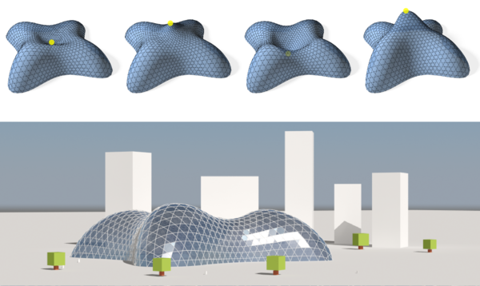

--
title: Interactive Design Exploration for Constrained Meshes
authors: Alexandre Kaspar, Boris Neubert, Dani Lischinski, Mark Pauly, Johannes Kopf
event: Eurographics
date: 2015
---

# Interactive Design Exploration for Constrained Meshes
Bailin Deng, Sofien Bouaziz, Mario Deuss, Alexandre Kaspar, Yuliy Schwartzburg and Mark Pauly

Computer-Aided Design 61: 13-23, 2015

## Abstract

In architectural design, surface shapes are commonly subject to geometric constraints imposed by material, fabrication or assembly. Rationalization algorithms can convert a freeform design into a form feasible for production, but often require design modifications that might not comply with the design intent. In addition, they only offer limited support for exploring alternative feasible shapes, due to the high complexity of the optimization algorithm.
We address these shortcomings and present a computational framework for interactive shape exploration of discrete geometric structures in the context of freeform architectural design. Our method is formulated as a mesh optimization subject to shape constraints. Our formulation can enforce soft constraints and hard constraints at the same time, and handles equality constraints and inequality constraints in a unified way. We propose a novel numerical solver that splits the optimization into a sequence of simple subproblems that can be solved efficiently and accurately.
Based on this algorithm, we develop a system that allows the user to explore designs satisfying geometric constraints. Our system offers full control over the exploration process, by providing direct access to the specification of the design space. At the same time, the complexity of the underlying optimization is hidden from the user, who communicates with the system through intuitive interfaces.

## Links
* [Paper](https://drive.google.com/open?id=10q2JLEMuqSn3bw14W1WSLR_B6Blqxaih)
* [Video](https://drive.google.com/open?id=1WLRi_OfvQCCUJUf3eG4dUvtWu-762X1o)
* [Youtube](https://www.youtube.com/watch?v=gh-OAmWPaps)

