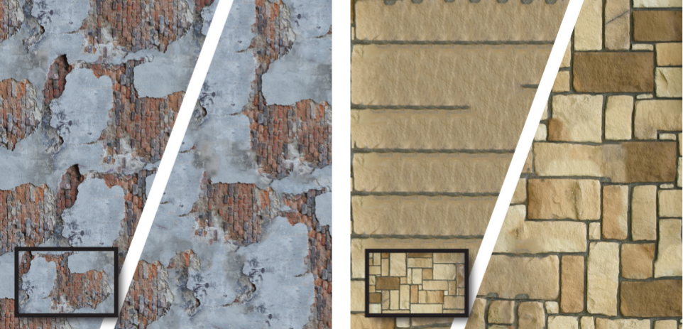

# Self Tuning Texture Optimization
Alexandre Kaspar, Boris Neubert, Dani Lischinski, Mark Pauly, Johannes Kopf

Eurographics 2015

## Abstract

The goal of example-based texture synthesis methods is to generate arbitrarily large textures
from limited exemplars in order to fit the exact dimensions and resolution required
for a specific modeling task. The challenge is to faithfully capture all of the visual
characteristics of the exemplar texture, without introducing obvious repetitions or
unnatural looking visual elements. While existing non-parametric synthesis methods
have made remarkable progress towards this goal, most such methods have been demonstrated
only on relatively low-resolution exemplars. Real-world high resolution textures often contain
texture details at multiple scales, which these methods have difficulty reproducing faithfully.
In this work, we present a new general-purpose and fully automatic self-tuning non-parametric
texture synthesis method that extends Texture Optimization by introducing several key
improvements that result in superior synthesis ability. Our method is able to self-tune
its various parameters and weights and focuses on addressing three challenging aspects
of texture synthesis:
(i) irregular large scale structures are faithfully reproduced through the use of automatically
generated and weighted guidance channels;
(ii) repetition and smoothing of texture patches is avoided by new spatial uniformity constraints;
(iii) a smart initialization strategy is used in order to improve the synthesis of regular
and near-regular textures, without affecting textures that do not exhibit regularities.
We demonstrate the versatility and robustness of our completely automatic approach on a variety
of challenging high-resolution texture exemplars.

## Links
* [Paper](paper.pdf)
* [Supplementary Material](supplementary/index.html) ([zip](supplementary.zip))
* [Slides](slides.pptx)
* [Code (v2)](code-v2.zip), ([v1](code-v1.zip))
